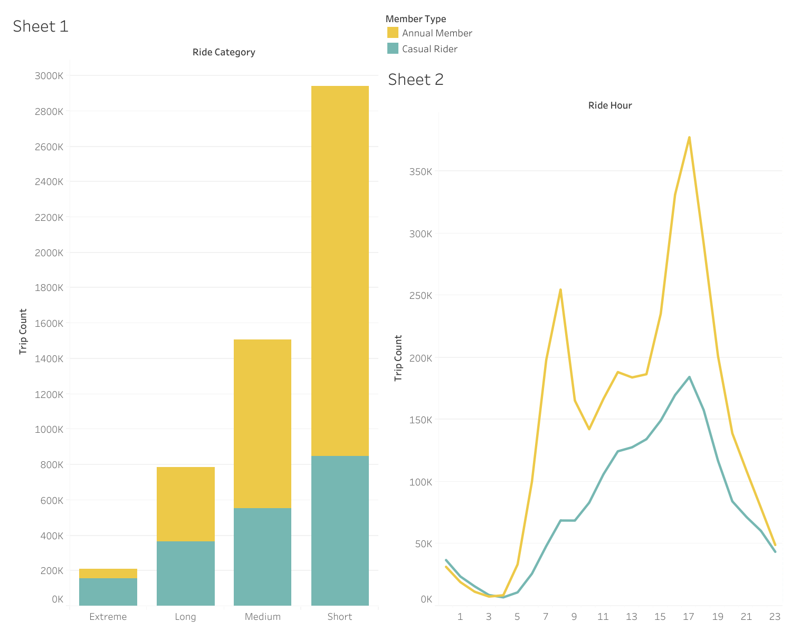
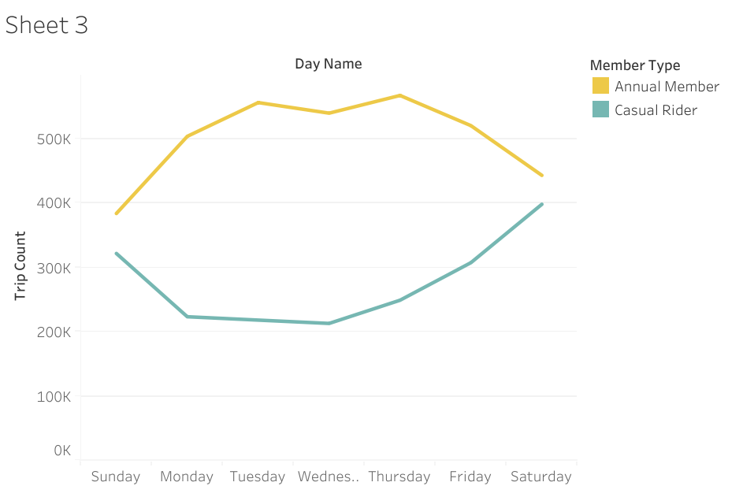

# Cyclistic-Bike-Share-Analysis
Data analysis case study using SQL to compare annual members and casual riders.
This project analyzes 12 months of historical trip data from Cyclistic, a fictional bike-share company in Chicago. The goal is to identify trends in how annual members and casual riders use the service differently to help design marketing strategies for converting casual riders into members.
## The Business Task

Primary Objective: How do annual members and casual riders use Cyclistic bikes differently?

Key Stakeholders: Cyclistic Executive Team and Director of Marketing (Lily Moreno).

## Data Source & Structure
Content:

Dataset: Divvy Trip Data (December 2024 - November 2025).

Data Scale: 12 monthly CSV files merged into a single SQL database containing 5.6 million rows.

## Technical Stack
Content:

SQL Server (SSMS): Data ingestion, cleaning, and transformation.

GitHub: Version control and project documentation.

Power BI / Tableau: (Add which one you choose later) for data visualization.

## Data Processing & Cleaning

Step 1: Data Ingestion
Merged 12 individual monthly tables using UNION ALL into a master table Combined_Trip_Data. Used SELECT INTO for efficient bulk data movement.

Step 2: Data Quality Audit
Initial profiling revealed the following issues:

Negative/Zero Durations: 29 rows.

Short Trips (< 60s): 146,319 rows (Likely maintenance or false starts).

Missing Station Data: ~1.8M rows (Primarily electric bikes).

Step 3: Cleaning Actions
Removed trips less than 60 seconds and negative durations to prevent skewed averages.

Retained rows with missing station names for temporal (time-based) analysis as ride timestamps were 100% complete.

Step 4: Feature Engineering
Created new columns for analysis:

ride_length_min: Calculated duration in minutes.

day_of_week_name: Extracted day name (Monday-Sunday) for weekly patterns.

day_of_week_number: Extracted for logical sorting.

month_name: Extracted for seasonal analysis.
## ANALYSIS 
Data Insights & Business Strategy
The Duration Gap: Casual riders average 23 minutes, while Members average 12 minutes. This result fostered an idea that adding a tiered Annual Membership might help because casual riders though tend to ride almost 2x more longer on average still do not want to buy member pass which concludes that they might be riding very infrequently so i decided to have a deeper insight of the ride durations categorized by casual and member and their ride interval (Short, Medium , Long) to verify that actually how many casual riders travel medium or more distance per ride.

The High-Value Segment: While most rides are short, 157,481 Casual trips exceeded 45 minutes (3x more than Members).

Strategic Recommendation: Target these "Extreme" duration casual riders with a Tiered Annual Membership (e.g., a "1,000-minute annual pass") to provide a cheaper alternative to single-ride passes. This can be a good stragetic alternative to convert those casual riders into annual members

Hourly analysis confirms a structural difference in usage: Members peak during 8 AM and 5 PM commute windows, while Casual ridership peaks gradually in the mid-afternoon (2 PM - 4 PM), supporting the transition to a leisure-focused membership tier.

### 📊 Data Visualization & Behavioral Analysis

Key Findings:

The Duration Gap: My analysis of trip categories shows that while Annual Members are frequent users, Casual riders dominate the 'Extreme' (>45 min) trip segment. This suggests Casuals use the service for long-duration leisure, while Members use it for utility.

The Commuter Profile: The hourly trend lines confirm this. Annual Members show sharp usage spikes at 8:00 AM and 5:00 PM (the classic 9-to-5 commute). Casual ridership builds slowly, peaking in the afternoon without a morning spike, confirming a leisure-heavy user base.The Spike on the graph for casual buyers during weekends also confirms the difference between the behaviours of casual and annual members.

### 💡 Final Recommendations for the Marketing Team
Based on the 5.4 million rows analyzed, I recommend the following strategy to convert Casual riders to Annual Members:

Target the "Extreme" Riders: Target high-duration casual riders (30+ minutes) through personalized marketing campaigns that highlight potential savings from reduced overage fees, encouraging transition toward membership plans.

The "Minute-Bank" Entry Tier:Introduce a mid-tier membership model based on a capped annual minute allocation (e.g., 500–1000 minutes per year) targeted at high-duration casual riders.

This segment demonstrates a clear mismatch with existing pricing structures—they incur high per-trip costs due to longer ride durations but may not engage frequently enough to justify a full annual membership.

A “Minute-Bank” model reduces the financial friction of long rides while maintaining a lower commitment threshold, making it an effective transition point between pay-per-ride usage and full annual membership.

Morning Commuter Trial: Since Casual riders are more active during weekends introducing only weekend passes can be a good approach to target those buyers and convert them.

Afternoon Conversion Window: Digital ads and station kiosks should push membership offers between 3:00 PM and 5:00 PM, which is when Casual ridership is at its highest volume.
### 🛠️ Technical Challenges & Data Engineering
Analyzing a dataset of this scale (5.4M+ rows) presented several "real-world" hurdles that required a structured SQL-first approach:

The "Big Data" Memory Wall: Standard spreadsheet tools (Excel/Google Sheets) could not process the 5.4 million rows without crashing. I migrated the entire dataset into SQL Server (SSMS) to perform heavy-duty cleaning and aggregation, reducing the final output to a high-performance summary table.

The CSV Delimiter Conflict: During the initial Tableau import, column data began "shifting" and mixing. I identified that internal commas and parentheses in my Ride_Category strings (e.g., Long (30-45 mins)) were being misinterpreted as delimiters.

The Fix: I refactored the SQL CASE Statement to remove all special characters, simplifying categories to clean, alphanumeric strings. This ensured 100% data integrity during the export-to-import process.

Data Type Mismatch: Tableau initially struggled to recognize the aggregated trip counts as numerical measures. I resolved this by explicitly casting the counts as INT in the final SQL view to ensure proper summation in the dashboard.

Logical Filtering: The raw data contained "garbage" entries (trips with negative durations or test station names). I implemented a WHERE clause in SQL to filter out all trips under 60 seconds and those without valid station IDs, ensuring the final insights were based on genuine user behavior.
